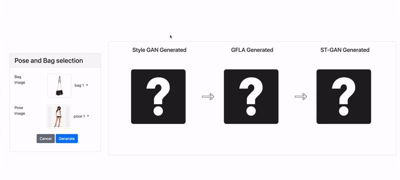

# AdGen
An Auto-Generator for Ads with Never-Seen-Before Humans

More about the project: [Final Report](https://dlproject566.medium.com/adgen-an-auto-generator-for-ads-with-never-seen-before-humans-877f940bfc50), [Addendum](https://tensorheads.github.io/)

* You will find all the dataset files in npy format at this Google Drive Link: [dataset](https://drive.google.com/drive/folders/13HJxIfoGWk-g1r6SEXlX5DzqTzBuzhSF) and the web crawled and pre-processed images in the CrawlingImages folder of this repo. 

* To run the StyleGAN2 model: Simply run the test.sh file available in the stylegan2 folder to generate images of brand new never-seen-before humans. 

* To run the GFLA model: Clone the repository from the original paper found here: [GFLA repo](https://github.com/RenYurui/Global-Flow-Local-Attention) and then run the test.py file to generate the human models in the required poses. Run createPairsCSV.py to create the pairs that map the output of GFLA to output of StyleGAN2. The output of the StyleGAN2 + GFLA method can be found in the fashion_900.zip file in the dataset Google Drive link.

* To run the disentanglement model: Clone the repository from the original paper found here: [Disentangle person image generation method repo](https://github.com/charliememory/Disentangled-Person-Image-Generation) and then run the [run_DF_test.sh](https://github.com/charliememory/Disentangled-Person-Image-Generation/blob/master/run_DF_test.sh) script to generate brand new humans in fixed poses sampled from noise and trained on DeepFashion Dataset. You will also need to modify the code in run_DF_test.sh and tester.py to sample appearances and keep the poses fixed which is different from the default available in the files. The 'G' folder in the dataset Google Drive link has the output of the disentanglement method. 

* To calculate the MSE Loss or Inception scores of the StyleGAN2 + GFLA and Disentanglement approaches, you can use the files available inside comparisonOfModels folder of this repo. To calculate MSE Loss between input and output poses, run mselosscalc.py and replace the estimator.py file with the estimator.py file available in the repo. 

* To train the ST-GAN model on the DeepFashion dataset: Please find all the training and test files in the st-gan folder. Simply download the code along with the datasets available in the dataset google drive link and place the datasets in the my_data folder inside the st-gan folder. Make sure to change the local paths in data.py and in the test and train scripts if you are running in Windows to absolute paths (relative paths doesn't seem to work in Windows). 
